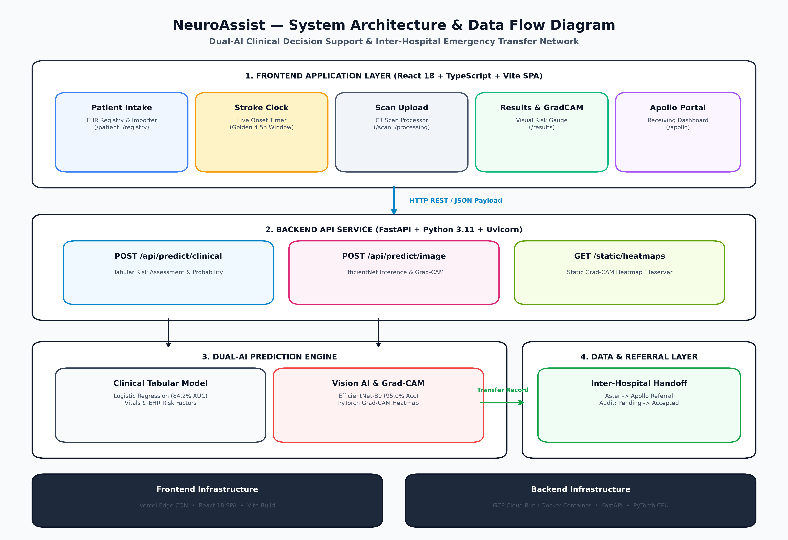
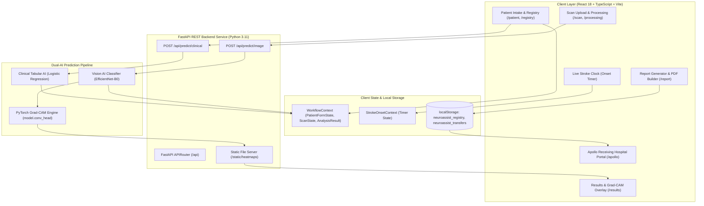

# NeuroAssist — System Architecture Documentation

> **Complete End-to-End Architectural Specification of the NeuroAssist Clinical AI Decision Support & Inter-Hospital Referral Platform.**



---

## 1. System Overview Diagram

```
┌──────────────────────────────────────────────────────────────────────────────────────────────────┐
│                                     CLIENT LAYER (BROWSER UI)                                    │
│                                                                                                  │
│  ┌────────────────────────────────────────────────────────────────────────────────────────────┐  │
│  │                            React 18 + TypeScript + Vite SPA                                │  │
│  └─────────────────────────────────────────────┬──────────────────────────────────────────────┘  │
│                                                │                                                 │
│       ┌────────────────────────────────────────┼────────────────────────────────────────┐        │
│       ▼                                        ▼                                        ▼        │
│ ┌───────────┐                            ┌───────────┐                            ┌───────────┐  │
│ │  Patient  │                            │  Stroke   │                            │ Inter-Hosp│  │
│ │ Registry  │                            │   Clock   │                            │ Transfers │  │
│ └─────┬─────┘                            └─────┬─────┘                            └─────┬─────┘  │
│       │                                        │                                        │        │
│       └────────────────────────────────────────┼────────────────────────────────────────┘        │
│                                                ▼                                                 │
│                                 ┌─────────────────────────────┐                                  │
│                                 │   State & Local Storage     │                                  │
│                                 │ (WorkflowContext / Registry)│                                  │
│                                 └──────────────┬──────────────┘                                  │
└────────────────────────────────────────────────┼─────────────────────────────────────────────────┘
                                                 │ HTTP / REST API (CORS)
                                                 ▼
┌──────────────────────────────────────────────────────────────────────────────────────────────────┐
│                                   API LAYER (FASTAPI BACKEND)                                    │
│                                                                                                  │
│  ┌────────────────────────────────────────────────────────────────────────────────────────────┐  │
│  │                          FastAPI Router & CORS Middleware                                  │  │
│  └───────┬─────────────────────────────────────┬──────────────────────────────────────┬───────┘  │
│          │                                     │                                      │          │
│          ▼                                     ▼                                      ▼          │
│  ┌───────────────┐                     ┌───────────────┐                      ┌───────────────┐  │
│  │ /predict/     │                     │ /predict/     │                      │ /static/      │  │
│  │  clinical     │                     │     image     │                      │  heatmaps     │  │
│  └───────┬───────┘                     └───────┬───────┘                      └───────┬───────┘  │
└──────────┼─────────────────────────────────────┼──────────────────────────────────────┼──────────┘
           │                                     │                                      │
           ▼                                     ▼                                      │
┌───────────────────────────────────────────────────────────────────────────────────────┼──────────┐
│                                      AI PIPELINE                                      │          │
│                                                                                       │          │
│  ┌───────────────────────────┐         ┌───────────────────────────┐                  │          │
│  │  Clinical Tabular Model   │         │    Vision AI Classifier   │                  │          │
│  │   (Logistic Regression)   │         │     (EfficientNet-B0)   │                  │          │
│  │   Input: Age, BP, Glucose │         │   Input: 224x224 Head CT  │                  │          │
│  └───────────┬───────────────┘         └─────────────┬─────────────┘                  │          │
│              │                                       │                                │          │
│              ▼                                       ▼                                │          │
│  ┌───────────────────────────┐         ┌───────────────────────────┐                  │          │
│  │ Risk Level & Probability  │         │ PyTorch Grad-CAM Heatmap  ├──────────────────┘          │
│  └───────────────────────────┘         └───────────────────────────┘                             │
└──────────────────────────────────────────────────────────────────────────────────────────────────┘
```

---

## 2. Mermaid Sequence & Architecture Diagram



---

## 3. Layer-by-Layer Architectural Specification

### 3.1 Client Layer (Frontend Application)
* **Framework:** React 18, TypeScript, Vite SPA.
* **UI Design System:** Custom Tailwind CSS tokens (`bg-steel-50`, `border-steel-900`, `shadow-card`), Lucide Icons.
* **Navigation & Routing:** React Router v6.
  * `/home`: Landing dashboard & feature overview.
  * `/patient`: Patient intake form & EHR importer.
  * `/scan`: DICOM/PNG CT scan upload processor.
  * `/processing`: Real-time AI inference loading state.
  * `/results`: Dual-AI prediction results, risk gauge, & Grad-CAM overlay.
  * `/report`: Structured clinical summary & `jsPDF` side-by-side export.
  * `/registry`: Electronic Health Record (EHR) registry.
  * `/transfers`: Aster Hospital outgoing transfer tracker.
  * `/apollo`: Apollo Hospital receiving portal (Login, Dashboard, Patient Review).
* **State Management:**
  * `WorkflowContext`: Encapsulates patient demography, vitals, scan state, and AI analysis outputs.
  * `StrokeOnsetContext`: Manages active stroke onset timestamp and real-time elapsed ticker.
* **Client PDF Engine (`pdfBuilder.ts`):** Client-side vector PDF generation featuring embedded CT scans, Grad-CAM heatmaps, risk metrics, and hospital transfer summaries.

---

### 3.2 API Layer (FastAPI Backend)
* **Framework:** FastAPI running on Uvicorn.
* **CORS & Static Files:** Configured for cross-origin access and static serving of generated Grad-CAM heatmaps (`/static/heatmaps`).
* **Core Endpoints:**
  * `POST /api/predict/clinical`: Accepts patient vitals (Age, BP, Glucose, BMI, Symptoms) and returns tabular risk probability, risk level, and contributing factors.
  * `POST /api/predict/image`: Accepts non-contrast head CT upload, executes `EfficientNet-B0` inference, generates a Grad-CAM heatmap overlay, and returns predictions with static file paths.
  * `GET /health`: Asynchronous system status and version check.

---

### 3.3 Dual-AI Prediction Pipeline
1. **Clinical Tabular Risk Engine**:
   * **Model:** Logistic Regression (`stroke_model.pkl`) with balanced class weighting.
   * **Features:** Age, Gender, Hypertension, Heart Disease, Average Glucose Level, BMI, Smoking History.
   * **Output:** Stroke Probability (%), Risk Category (Critical/High/Moderate/Low), Signal Breakdown.
2. **Vision AI Classifier (`EfficientNet-B0`)**:
   * **Architecture:** Deep transfer learning classifier (`timm` implementation) fine-tuned on non-contrast head CT scans.
   * **Input Tensor:** $224 \times 224 \times 3$ RGB normalized image tensor.
   * **Classification Classes:** `Bleeding` (Hemorrhage), `Ischemia` (Infarct), `Normal` (Control).
   * **Validation Performance:** **95.04% Accuracy**, **97.26% Bleeding Recall**.
3. **Explainable AI Engine (`pytorch-grad-cam`)**:
   * **Layer Target:** `model.conv_head` (Final spatial convolutional feature map).
   * **Mechanism:** Computes backward gradients of the predicted class score with respect to feature activation maps, generating a $224 \times 224$ thermal heatmap overlaid on the CT scan.

---

### 3.4 Inter-Hospital Transfer & Data Flow
* **Data Isolation:** `PatientFormState` (AI input) is kept strictly decoupled from `RegistryPatient` (full EHR record).
* **Boundary Mapping:** `registryPatientToFormState()` maps registry EHR data to AI inputs without polluting the prediction pipeline.
* **Transfer Snapshots (`TransferRecord`):** Immutable referral snapshots containing patient vitals, AI outputs, CT scan preview URLs, Grad-CAM heatmap paths, onset timestamps, and status timelines (`Pending` $\rightarrow$ `Received` $\rightarrow$ `Viewed` $\rightarrow$ `Accepted`).
* **Apollo Receiving Dashboard:** Auto-polling (5s) portal for receiving hospital doctors (e.g., Dr. Rajesh Menon) to inspect incoming transfers, review Grad-CAM heatmaps, and confirm acceptance with full timestamp audit trails.

---

### 3.5 Infrastructure & Deployment Topology

| Component | Target Platform | Container / Runtime |
| :--- | :--- | :--- |
| **Frontend Application** | **Vercel** | Node.js / Vite Static Edge CDN |
| **Backend API** | **Google Cloud Run / Railway** | Docker Container (Python 3.11, PyTorch CPU) |
| **Model Storage** | **Local / Cloud Storage** | Persistent checkpoints (`best_model.pth`, `stroke_model.pkl`) |
